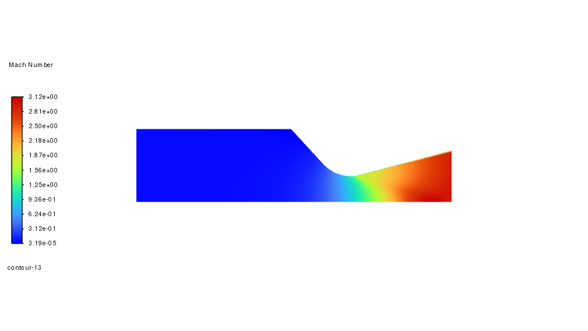
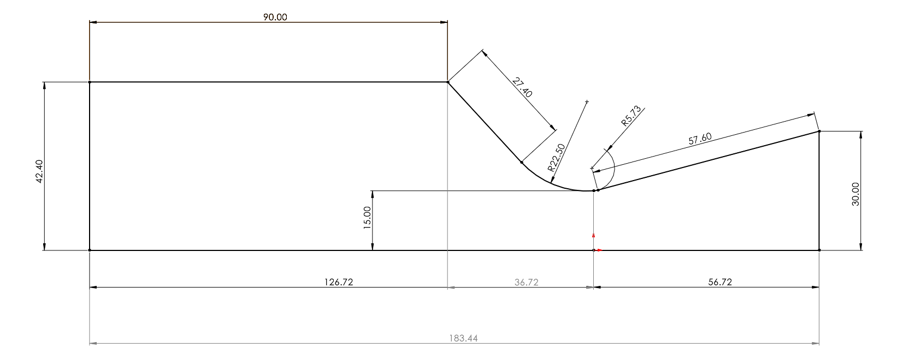
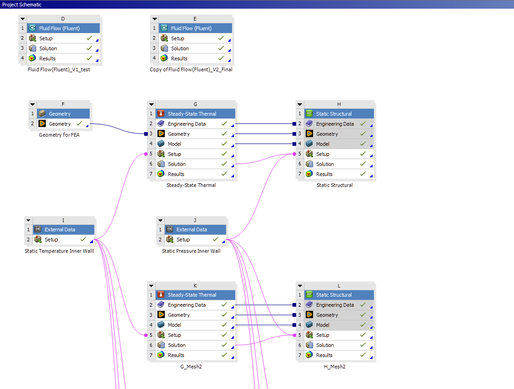
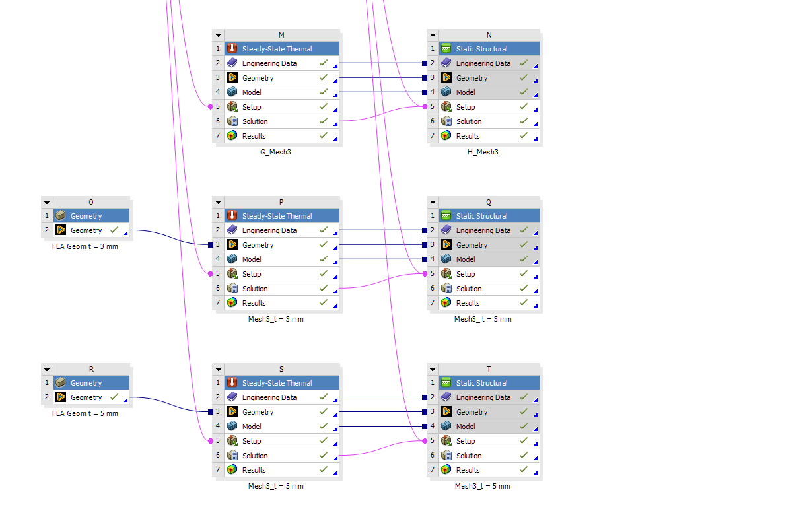
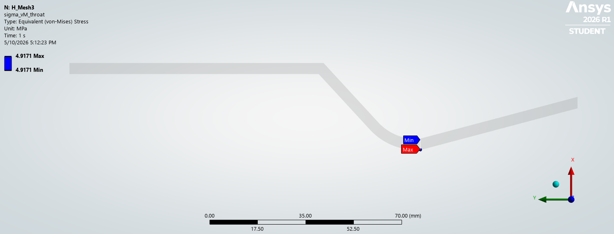

# Thermal and Structural Feasibility of an Uncooled SS316 Conical Convergent-Divergent Nozzle


Multiphysics analysis of an uncooled stainless-steel converging-diverging nozzle. The study answers a single question: **can SS316 survive the combined thermal and pressure loading at the design operating point?**

The short answer is *yes against yield, no against creep*, and the engineering value of the project is in showing why that distinction matters for material selection.

---

## Headline result

| Metric | Value | Source |
|---|---|---|
| Throat von Mises stress (mesh-converged) | **4.92 MPa** | Phase 5, Mesh 3 |
| SS316 yield strength at 530 °C (interpolated) | 210.0 MPa | BS EN 10088-1 |
| **Factor of safety against yield** | **42.7** | Phase 5 |
| Through-wall ΔT at throat | 2.1 K | Phase 4 |
| Free axial thermal expansion | 1.72 mm over 190 mm | Phase 4 |


*Mach number contour, converged Fluent solution. Exit Mach 3.06 vs. area-Mach hand-calc value 2.94; within 4%, validation gate passed.*


*Nozzle half-section dimensions (mm). Throat radius 15, exit radius 30 (ε = 4), conical 30°/15° half-angles, 4 mm wall.*



*Six-phase workflow with explicit validation gates between phases.*


*Throat von Mises stress = 4.92 MPa at Mesh 3 (mesh-converged), yielding FoS = 41 against SS316 yield at  530 °C. The red region at the inlet vertex is the constraint singularity, empirically confirmed as non-physical by mesh-refinement divergence in Phase 5, and excluded from the FoS calculation.*

**The binding failure mode is not yield.** With wall temperature at ~530 °C — above the SS316 creep onset of ~410 °C (= 0.4·T_melt), sustained operation is creep-limited, not stress-limited. SS316 is viable for short-duration prototype/ground-test firings at this operating point. Sustained operation requires a creep analysis (Larson-Miller, ASME II-D) that is out of scope here.

---

## Operating point

| Parameter | Value | Notes |
|---|---|---|
| Chamber pressure, P_c | 2 MPa | Working air, γ = 1.4 |
| Chamber temperature, T_c | 800 K | Chosen to sit within SS316 ASME service limit (~816 °C) |
| Exit pressure, P_e | 0.1 MPa | Sea-level design |
| Throat radius, R_t | 15 mm | |
| Area ratio, A_e/A_t | 4 | |
| Contraction ratio, A_c/A_t | 8 | From M_inlet ≤ 0.1 constraint (min ≥ 5.9) |
| Wall thickness, t | 4 mm | Baseline; sensitivity at 3/4/5 mm |
| Geometry | Conical C-D | 30° converging, 15° diverging half-angles |
| Material | SS316 | Uncooled, temperature-dependent properties |

Material precedent: the IJIRSET 2019 H₂O₂ monopropellant thruster (Deif et al.) uses SS316 in a similar uncooled configuration. The conditions are not equivalent (lower P_c, smaller throat, pulsed operation, different working fluid), and the paper supports *material precedent only*.

---

## Tools & environment

| Phase | Tool | Notes |
|---|---|---|
| Hand calculations | Jupyter + handcalcs | Symbolic → numeric trace |
| CAD geometry | SolidWorks → SpaceClaim | 2D axisymmetric surface body |
| CFD | ANSYS Fluent 2026 R1 Student | 2D axisymmetric, k-ω SST |
| FEA | ANSYS Mechanical 2026 R1 Student | Steady-state thermal + static structural |
| Mesh | Fluent Meshing (CFD), Mechanical (FEA) | Combined node+element ≤ 32k ||

License is the ANSYS 2026 R1 Student release (valid through March 2027). The 32k combined node+element cap drove the decision to model in 2D axisymmetric throughout.

---

## Analysis workflow

Six phases, each gated by validation against the previous phase.

| # | Phase | Status | Deliverable |
|---|---|---|---|
| 1 | Hand calculations (isentropic, area-Mach, T_aw) | ✓ Complete | `notebooks/cd-nozzle-handcalc-checkpoint` |
| 2 | SolidWorks geometry (2D axisymmetric profile) | ✓ Complete | `cad/conical_v1_sketch` |
| 3 | CFD — ANSYS Fluent, 2D axisymmetric, k-ω SST | ✓ Complete | `docs/Phase3_CFD_Summary` |
| 4 | CFD/hand-calc validation gate | ✓ Passed | Documented in Phase 3 summary |
| 5 | One-way FSI → ANSYS Mechanical thermal-structural | ✓ Complete | `docs/Phase4_FEA_Summary_v3.md` |
| 6 | Mesh convergence study | ✓ Complete | `docs/Phase5_Convergence_Study_v2.md` |

The one-way FSI uses Fluent wall outputs (static temperature, static pressure) mapped onto the FEA mesh through ANSYS Workbench **External Data systems**.

---

## Key findings

1. **Yield is not the binding failure mode.** FoS ≈ 42.7 against yield at the throat, mesh-converged. Time-dependent creep is the limiting mode for sustained operation.
2. **The wall is essentially isothermal** through the thickness (Biot number = 0.0022). Uncooled SS316 in still air cannot dissipate heat fast enough to develop a meaningful through-wall gradient at steady state. The dominant stress contributor is pressure hoop, not thermal gradient.
3. **Mesh convergence is demonstrated** by a three-mesh trend study. The throat von Mises probe is stable to <1% between Mesh 2 and Mesh 3 (4.87 → 4.92 MPa). Global max von Mises diverges with refinement, empirically confirming the inlet-vertex constraint as a singularity rather than a physical hot spot.
4. **Three independent boundary-condition errors** were caught and corrected during Phase 4 — most consequentially, a convection film coefficient that was 6 orders of magnitude too high due to a units mismatch in Mechanical's active unit system (W/mm²·K vs W/m²·K). The pre-solve verification gate added in response to these errors is documented in `docs/Phase4_FEA_Summary_v2.md`

---

## Scoping & limitations

Stated up front because they are real and affect how the results should be read:

- **No creep model.** This is the active scope boundary. FoS against yield is not the binding limit for sustained operation. Creep is flagged as required future work, not silently omitted.
- **One-way FSI only.** No structural deformation feedback into CFD. Standard for preliminary analysis at this fidelity.
- **Adiabatic-wall CFD → imposed T_aw on FEA.** Conservative — credits no wall-side conduction or radiation relief.
- **2D axisymmetric.** No asymmetric loads. Acceptable for axisymmetric geometry and required by the license cell cap.
- **Mesh refinement ratios.** Linear refinement ratios are 1.24 (M1→M2) and 1.14 (M2→M3), tighter than the r ≥ 1.3 recommended for formal Grid Convergence Index per Celik 2008. The data is sufficient for a trend study but not for Richardson extrapolation. Stated as a limitation rather than treated as a flaw.
- **Outer-wall convection h = 10 W/m²·K.** Still-air natural convection; conservative for a test stand where exhaust-plume entrainment would add convective relief.

---

## Repository structure

```
C-D-Nozzle/
├── README.md                          # This file
├── docs/
│   ├── ss316_properties.md
│   ├── Phase3_CFD_Summary.md
│   ├── Phase4_FEA_Summary_v2.md
│   ├── Phase4_FEA_Summary_v3.md
│   ├── Phase5_Convergence_Study_v2.md
│   └── Phase5b_Sensitivity_Study.md

├── notebooks/
│   ├── cd-nozzle-handcalc-checkpoint.ipynb             # Phase 1
│   ├── convergence_study_handcalc-checkpoint.ipynb     # Phase 5
│   └── cwall_thickness_sensitivity-checkpoint.ipynb    # Phase 5b
├── cad/
│   ├── cad_dimensions.png
│   ├── conical_v1_sketch.sldprt                        # Solidwork source 2D/3D
│   ├── conical_v1_sketch.step                  
│   ├── conical_v2_spaceclaim.sketch.scdocs             # SpaceClaim geometry
│   ├── inlet_side.png                       
│   ├── isometric.png                           
│   ├── outlet_side.png                        
│   └── right_side.png                          
├── cfd/
│   ├── case_data/                                      # CFD Fluent data and setup
│   ├── figures/                                        # results, plots, contours
│   ├── exports/                                        # wall_temperature_v2.xy, wall_pressure_v2.xy, BC, and loads
│   └── mesh/                                           # Mesh data
├── fea/
│   ├── mesh1/                                          # Solved figures (von Mises, ΔT, deformation) and Mechanical data in mesh 1
│   ├── mesh2/                                          # Solved figures (von Mises, ΔT, deformation) and Mechanical data in mesh 2
│   └── mesh3/                                          # Solved figures (von Mises, ΔT, deformation) and Mechanical data in mesh 3
├── workbench/
    ├── project_schematic_part1.png                     # Analysis workflow
    └── project_schematic_part2.png
└── report/
    └── ss3316_cd_nozzle_report.pdf                     # Comprehensive report of the project
```

---

## Related work

- **`gas-vessel-fea`** — prior portfolio piece. Pressure vessel mesh convergence study; same methodological framework applied to a simpler geometry.

---

## Author

Mark Lorenz Yamanaka · Tsukuba · 2026
