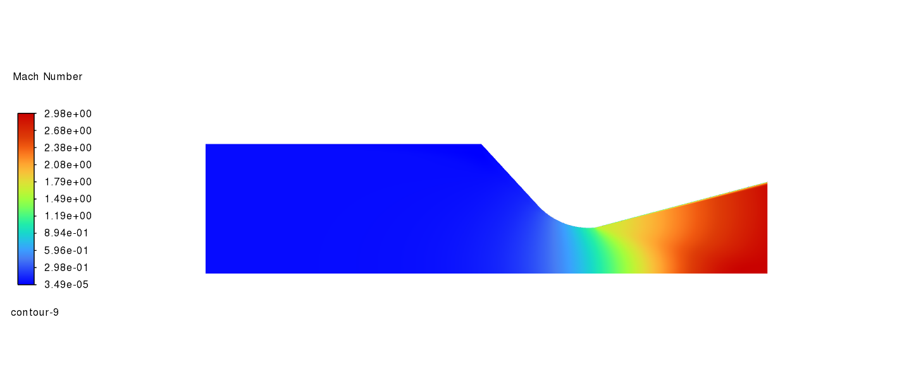
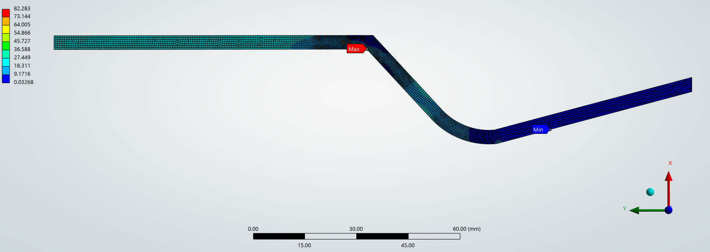
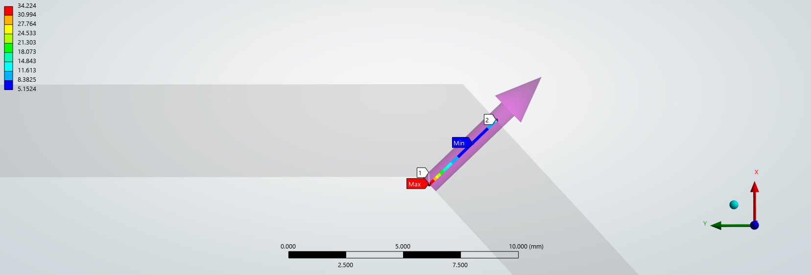
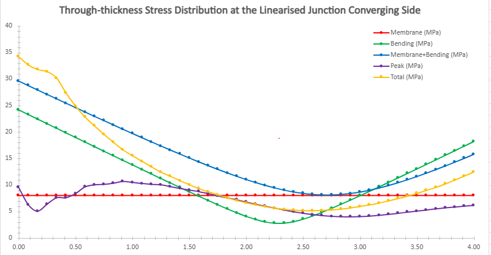
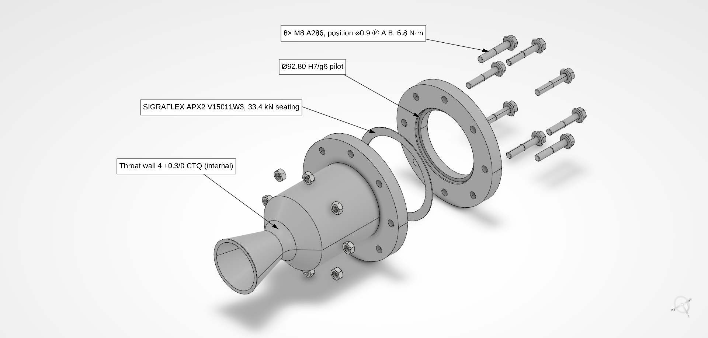

# SS316 Conical CD Nozzle: Thermal, Structural & DFM Assessment

Multiphysics analysis of an uncooled stainless-steel converging-diverging nozzle. The study answers a single question: **can SS316 survive the combined thermal and pressure loading at the design operating point?**

The short answer is yes against yield, with a FoS near 7 rather than the 42.7 reported in v1.0, and the binding questions are the startup transient and creep.

> **This is v2.0.** It supersedes v1.0, which reported a factor of safety of 42.70 at the throat. That figure was wrong by approximately 6x for two independent reasons: the wrong location was assessed, and the assessed quantity was not a classified stress. v1.0 is preserved under tag v1.0 and is not overwritten. See What changed in v2.0.


---


## Headline results

| Metric | Value | Source |
|---|---|---|
| Governing location | **Chamber-to-converging junction, converging side, inner surface** | Report §5.6 |
| Governing quantity | linearised membrane + bending (M+B); von Mises, axisymmetric straight | Report §5.5 |
| Governing stress (Mesh J3) | **29.611** | Report §5.6.1 |
| Mesh band, J1 to J3 | 29.611 to 30.010 MPa | Report §6.2 |
| SS316 yield at 526.83 °C (interpolated) | 210.73 MPa | SSINA Table 1 / Nickel Institute 9004 |
| Factor of safety against SS316 yield | **7.12 with a band 7.02 to 7.12** | Report §5.6.1 |
| Creep driver, primary membrane S₁ | 9.914 MPa | 	Report §5.6.3 |
| Through-wall ΔT at the junction| 1.26 K | Report §5.7 |
| Free axial thermal expansion (total deformation) | 1.711 mm over 183.44 mm | Report §5.8 |
| CFD peak wall y+ | 	1.74 (viscous sublayer resolved) | Report §4.2 |
| CFD mass imbalance | 	3.0 × 10⁻⁵ % | Report §4.3 |
| Discharge coefficient | 0.977 | Report §4.4 |


**Mach number** contour from the converged Fluent solution Mach number contour, converged Fluent solution on the structured 88,800-cell mesh. Area-weighted exit Mach 2.85 against hand-calc 2.94, within 3.1% (validation gate passed). Peak 2.98 is the inviscid core value, not the bulk exit.


**Nozzle half-section dimensions (mm)**. Throat radius 15 (nominal; as-built minimum 14.942 at −0.77 % area (see Geometry Freeze Disposition), exit radius 30 (ε = 4). Divergent side: 14.8° throat-to-exit chord angle (the straight diverging segment itself is 14.91°). Convergent side: a straight 47.43° taper from the chamber blended into the throat through an R22.5 arc. 4 mm wall.


**One-way FSI chain:** two External Data systems feed a steady-state thermal and a static structural system, with explicit validation gates between phases.





**The 82.283 MPa maximum** is located at the unfilleted jucntion kink, is re-entrant and therefore singular, and is excluded from the assessment. The reported 29.611 is the linearised M+B (a seperate stress quantity that feeds combined tensor components into von Mises) on a through-thickness path adjacent to that corner. The v1.0 inlet-vertex displacement constraint singularity is absent; it was eliminated by moving the displacement constraint from a vertex to the full inlet edge.

**The binding failure modes are not yield.** The wall runs at approximately 527 °C at the junction, above the SS316 410 °C creep onset, with a non-relaxing primary membrane driver of 9.914 MPa. SS316 remains viable for short-duration prototype and ground-test firings at this operating point. Sustained or flight-rated operation requires the transient and creep work listed under Future work.

---


## Operating point


| Parameter | Value | Notes |
|---|---|---|
| Chamber pressure, P_c | 2 MPa | Working air, γ = 1.4 |
| Chamber temperature, T_c | 800 K | Within SS316 continuous-service limit (925 °C, oxidizing) |
| Exit pressure, P_e | 0.1 MPa | Sea-level design |
| Throat radius, R_t | 15 mm | |
| Area ratio, A_e/A_t | 4 | |
| Contraction ratio, A_c/A_t | 8 | From M_inlet ≤ 0.1 constraint (min ≥ 5.9) |
| Wall thickness, t | 4 mm | Baseline; sensitivity at 3/4/5 mm |
| Geometry | Conical C-D | Diverging straight taper 14.91° half-angle (14.8° throat-to-exit chord); converging straight taper 47.43° half-angle, blended into the throat by an R22.5 arc (no junction fillet). As-built, verified from CAD/STEP — see `docs/Geometry_Freeze_Disposition.md` |
| Material | SS316 | Uncooled, temperature-dependent properties |

All pressures reported in v2.0 are **absolute**. Any figure carrying a gauge scale belongs to v1.0.

**Material precedent:** the IJIRSET 2019 H₂O₂ monopropellant thruster (Deif et al.) uses SS316 in a similar uncooled configuration. Conditions differ (lower chamber pressure, smaller throat, pulsed, different working fluid), so it supports material precedent only.


---


## Tools & environment

| Phase | Tool | Notes |
|---|---|---|
| Hand calculations | Jupyter + handcalcs | Symbolic → numeric trace |
| CAD geometry | SolidWorks → SpaceClaim | 2D axisymmetric surface body |
| CFD | ANSYS Fluent 2026 | 2D axisymmetric, density-based coupled, k-ω SST |
| CFD mesh | ANSYS Meshing (classic); 2D Fluent system | Structured mapped quad, 444 × 200, 88,800 cells. Replaces Fluent Meshing in v1.0 |
| FEA | ANSYS Mechanical 2026 | Steady-state thermal + static structural |
| FEA Mesh | Fluent Meshing (CFD), Mechanical (FEA) | Quad-dominant, junction-refined ladder J1/J2/J3 |


---


## Analysis workflow

Six phases, each gated by validation against the previous phase.

| # | Phase | Status | Deliverable |
|---|---|---|---|
| 1 | Hand calculations (isentropic, area-Mach, T_aw) | Complete | `notebooks/cd-nozzle-handcalc-checkpoint.ipynb` |
| 2 | SolidWorks geometry (2D axisymmetric profile, 4 mm wall offset) | Complete | `cad/conical_v1_sketch.SLDPRT` |
| 3 | CFD: ANSYS Fluent, 2D axisymmetric, k-ω SST | Complete | `docs/Phase3_CFD_Summary.md` |
| 4 | FEA: one-way FSI → ANSYS Mechanical thermal-structural | Complete | `docs/Phase4_FEA_Summary_v3.md` |
| 5 | Mesh convergence study | Complete | `docs/Phase5_Convergence_Study_v2.md`, `notebooks/convergence_study_handcalc-checkpoint.ipynb` |
| 6 | Wall-thickness sensitivity study | Complete | `docs/Phase5b_Sensitivity_Study.md`, `notebooks/wall_thickness_sensitivity-checkpoint.ipynb` |

The one-way FSI uses Fluent wall outputs (static temperature, static pressure) mapped onto the FEA mesh through ANSYS Workbench **External Data systems**.


---


## Key findings

1. **The chamber-to-converging junction governs, not the throat.** At the unfilleted cylinder-to-convergent discontinuity, linearised M+B is 29.611 MPa against 17.183 MPa at the throat fillet: a 1.72x difference. 

2. **Bending dominates, and increasing thickness improves FoS, reversing the v1.0 trend.** Bending contributes 71 to 77% of M+B. Junction FoS is 4.62 / 7.12 / 10.18 for t = 3 / 4 / 5 mm. The v1.0 throat FoS values of 53.27 / 42.70 / 33.96 are withdrawn. Thermal bending is real but contributes only 4 to 16% at the junction. At the throat, the pressure state is anticlastic and nearly stress-free, leaving thermal stress as the dominant component there.

3. **The governing metric does not converge monotonically, so the result is reported as a band.** Governing von Mises M+B changes only −0.08% then −1.25% across J1/J2/J3.

4. **Steady-state thermal loading is small.** Natural convection accounts for 99.64% of the thermal resistance. Of the available 500 K wall-to-ambient difference, approximately 498 K occurs across the external film and only ~1 K across the wall.

5. **The same thermal boundary condition fails validation in the axial profile.** The imported wall temperature spans only 17 K, versus approximately 56 K expected from recovery theory, and exceeds the 800 K stagnation temperature by up to 9 K. Thus, a realistic axial thermal load is missing. At the junction, Saint-Venant decay bounds the consequence (91 mm extent vs. 13.3 mm decay length); in the divergent section, it does not. This is reported as a failed validation gate, not re-scoped into a pass.

6. **Seventeen FEA validation gates were applied, with two failures.** The validation included independent equilibrium checks: net axial thrust vs. CFD wall integral (0.20%) and axial membrane identity F/A_ring (0.001%). The two failed gates were throat path-length validation and imported wall temperature vs. recovery theory. Their consequences are explicitly bounded rather than hidden.


---


## The Design for Manufacturing (DFM) Package

The feasibility result above is only useful if the part can be made and inspected. The analysis is therefore carried into a **fabricable engineering package**: a GD&T'd, toleranced drawing set for the inlet joint, tolerance stack-ups that close against the frozen FEA geometry, a machining route, an inspection plan, a BOM, and a mock supplier RFQ.

**Scope** is a short-duration, ground-test prototype, quantities 1 to 5. Drawing set is ASME Y14.5-2018, first-angle, A2, issued Revision C (2026-08-13).



Inlet-joint assembly (CDN-000). Nozzle body, flexible-graphite gasket, mounting flange, 8 x M8 A286 floating fasteners.

| Sheet | Part | Key controls |
|---|---|---|
| [CDN-001](dfm/drawing/CDN-001.pdf) | C-D Nozzle Body | frozen internal contour by surface profile 0.2 A\|B + total runout 0.05 A\|B; throat wall **4 +0.3/0 (CTQ)**; pilot Ø92.80 g6 |
| [CDN-002](dfm/drawing/CDN-002.pdf) | Mounting Flange | register bore Ø92.80 H7 with ⊥0.05 A; seat flatness 0.05 |
| [CDN-000](dfm/drawing/CDN-000.pdf) | Inlet-joint Assembly | ballooned BOM, interface notes, bolt torque 6.8 N·m cold |


### Four main decisions that carry this package

1. **Pilot locates, bolts clamp.** A single Ø92.80 H7/g6 locational-clearance fit centres the flange (Datum B); the 8 x M8 fasteners float and only clamp, positioned at MMC.
2. **The CTQ is the throat wall, and it is not a yield argument.** The 4 +0.3/0 band comes from creep life at ~530 °C, pressure-boundary minimum material, and machining minimum. The sensitivity study confirms the whole band is structurally free (FoS ≈ 40 across it), which is exactly why the tolerance had to be justified on other grounds.
3. **The stacks close, with margin.** Worst-case 1-D concentricity 0.060 mm against a 0.10 mm limit (1.68x); the bolt pattern assembles at strict MMC with no reliance on bonus tolerance.
4. **Every value is traceable.** Each dimension, tolerance and fit is tied to a source and a claim tier in the [value register](dfm/docs/value-register.md) and [`SOURCES.md`](dfm/sources/SOURCES.md), down to the gasket bolt load taken from ASME BPVC VIII-1 Mandatory Appendix 2.


**Full package: [`dfm/README-dfm.md`](dfm/README-dfm.md)**


---


## Scoping & limitations

- **No creep model.** The wall runs above the SS316 creep threshold. The driver is the primary membrane S₁ of 9.914 MPa, not the 29.611 MPa headline, because secondary bending relaxes under sustained load.
- **Steady-state only.** No transient startup/shutdown or thermal-fatigue/cyclic loading; The short-duration-firing conclusion does not cover cyclic life.
- **One-way FSI only.** No structural deformation feedback into CFD. Standard for preliminary analysis at this fidelity.
- **No junction fillet.** The sharp re-entrant corner makes Peak singular and mesh-dependent, so Peak and Total are excluded at that location. 
- **CFD rests on a single mesh** Iterative convergence demonstrated and five physical gates pass; discretisation error is not quantified.
- **Governing path is non-monotone under mesh refinement.** No valid Richardson order or GCI on the reported quantity. Reported as a band, 7.02 to 7.12.
- **Adiabatic-wall CFD → imposed T_aw on FEA.** Conservative; credits no wall-side conduction or radiation relief.
- **2D axisymmetric.** No asymmetric loads. Acceptable for axisymmetric geometry and required by the license cell cap.
- **Outer-wall convection h = 10 W/m²·K.** Still-air natural convection; conservative for a test stand where exhaust-plume entrainment would add convective relief.

---

## Operating point

| Parameter | Value | Notes |
|---|---|---|
| Chamber pressure, P_c | 2 MPa | Working air, γ = 1.4 |
| Chamber temperature, T_c | 800 K | Within SS316 continuous-service limit (925 °C, oxidizing) |
| Exit / back pressure, P_e | 0.060 MPa absolute | 60,000 Pa. Corrects the v1.0 record of 0.1 MPa; consistent with isentropic 59,574 Pa |
| Throat radius, R_t | 15 mm | |
| Area ratio, A_e/A_t | 4 | |
| Contraction ratio, A_c/A_t | 8 | From M_inlet ≤ 0.1 constraint (min ≥ 5.9), NASA SP-8120 |
| Wall thickness, t | 4 mm | Baseline, normal offset; sensitivity at 3/4/5 mm |
| Geometry | Conical C-D | 14.8° divergent half-angle; converging wall 46.25° from the axis, blended into the throat by an R22.5 arc; **no junction fillet** |
| Material | SS316 | Uncooled, temperature-dependent E and α |
| Allowable basis | Typical short-time values | Not specified-minimum. Flagged as future work |

All pressures reported in v2.0 are **absolute**. Any figure carrying a gauge scale belongs to v1.0.

Material precedent: the IJIRSET 2019 H₂O₂ monopropellant thruster (Deif et al.) uses SS316 in a similar uncooled configuration. Conditions differ (lower chamber pressure, smaller throat, pulsed, different working fluid), so it supports material precedent only.


---


## What changed in v2.0?

| # | Change | Effect |
|---|---|---|
| 1 | Governing location corrected: throat → chamber-to-converging junction | 8.602 → 29.611 MPa, 3.44x |
| 2 | Stress quantity corrected: body-scoped von Mises probe → linearized M+B | 4.917 → 8.602 MPa at the throat, 1.75x |
| 3 | **Combined effect on the headline** | **FoS 42.70 → 7.12** |
| 4 | Kinematic constraint: single vertex → full chamber-end edge | Constraint singularity removed; end-region M+B 91.34 → 19.54 MPa |
| 5 | Implementation of linearization set to Axisymmetric Straight on all objects | Converging-side M+B +12%; changed which side of the kink governs |
| 6 | Allowable evaluated at the governing-location temperature, 526.83 °C | 209.95 → 210.73 MPa |
| 7 | Mesh convergence re-scoped from throat to junction (J1/J2/J3) | Governing quantity now has convergence evidence, reported as a band |
| 8 | Thickness sweep re-scoped from throat to junction | Trend direction **reverses**; "FoS > 33 throughout" withdrawn; t = 3 mm gives 4.62 |
| 9 | FEA validation gates expanded from 3 to 17 | Two independent equilibrium closures, a formulation check, a thermal handoff check |
| 10 | CFD mesh replaced: unstructured hybrid (15,757 cells) → structured mapped quad (88,800 cells) | 100% quad, zero non-conformal interfaces, cell/node/face counts closed exactly |
| 11 | CFD near-wall clustering rebuilt: first cell 0.01 mm → 1.71 µm | Peak y+ 18 → 1.74; viscous sublayer resolved; retires limitation L1 |
| 12 | CFD mass imbalance 0.04% → 3.0 × 10⁻⁵ % | Three orders of magnitude |
| 13 | CFD pressure convention: gauge at 100 kPa reference → absolute at 0 Pa operating | Removes gauge/absolute ambiguity across all reported pressures |
| 14 | Discharge coefficient added as a CFD validation gate | Direct test of throat boundary-layer resolution; C_d = 0.977 |

**Why v1.0 was wrong but internally consistent** The v1.0 mesh convergence study was sound: four of five quantities of interest converged to within 1%. The assessment lies on a wrong probe scope, which is not a classified stress and not governing location. A converged wrong quantity is still wrong quantity. Therefore, investigating a non-governing location (throat) was not the correct approach and should have prompted a check of location and classification before publising.


---

## Repository structure

```
C-D-Nozzle/
├── README.md                                           # This file
├── docs/
│   ├── ss316_properties.md
│   ├── Geometry_Freeze_Disposition.md                  # Frozen as-built contour + deviation disposition
│   ├── Phase3_CFD_Summary.md
│   ├── Phase4_FEA_Summary_v2.md
│   ├── Phase4_FEA_Summary_v3.md
│   ├── Phase5_Convergence_Study_v2.md
│   └── Phase5b_Sensitivity_Study.md
├──dfm/
|   ├── calculations                                    # gasket loads, stack-up analysis and plot
|   ├── docs                                            # drawing data, specs, plans, records,  registers, decisions
|   ├── drawing                                         # official drawing sheets; CDN-000, CDN-001, CDN-002
|   ├── fair                                            # first article inspection request forms
|   ├── images                                          # isometric, inspection, and clash views
|   ├── revisions                                       # drawing sheet revision block records
|   ├── sources                                         # package source ledger (standards, materials, methods)
|   └── README-dfm.md                                   # DFM package summary
├── notebooks/
│   ├── cd-nozzle-handcalc-checkpoint.ipynb             # Phase 1
│   ├── convergence_study_handcalc-checkpoint.ipynb     # Phase 5
│   └── wall_thickness_sensitivity-checkpoint.ipynb     # Phase 6
├── cad/
│   ├── cad_dimensions.png
│   ├── conical_v1_sketch.SLDPRT                        # SolidWorks source 2D/3D
│   ├── conical_v1_sketch.STEP                  
│   ├── conical_v2_spaceclaim.sketch.scdocx             # SpaceClaim geometry
│   ├── inlet_side.png                       
│   ├── isometric.png                           
│   ├── outlet_side.png                        
│   └── right_side.png                          
├── cfd/
│   ├── case_data/                                      # CFD Fluent data and setup
│   ├── figures/                                        # results, plots, contours
│   ├── exports/                                        # wall_temperature_v2.xy, wall_pressure_v2.xy, BC, and loads
│   └── mesh/                                           # Mesh data
├── fea/
│   ├── mesh1/                                          # Solved figures (von Mises, ΔT, deformation) and Mechanical data in mesh 1
│   ├── mesh2/                                          # Solved figures (von Mises, ΔT, deformation) and Mechanical data in mesh 2
│   └── mesh3/                                          # Solved figures (von Mises, ΔT, deformation) and Mechanical data in mesh 3
├── workbench/
    ├── project_schematic_part1.png                     # Analysis workflow
    └── project_schematic_part2.png
└── report/
    └── ss316_nozzle_report.pdf                         # Comprehensive report of the project
```

---

## Related work

- **`gas-vessel-fea`** — prior portfolio piece. Pressure vessel mesh convergence study; same methodological framework applied to a simpler geometry.

---


## Author
Mark Lorenz Yamanaka · Tsukuba · 2026
