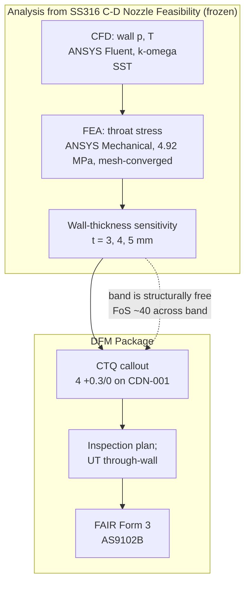

# Manufacturing Package (DFM)

The analysis above is carried into a **fabricable engineering package**: a GD&T'd, toleranced drawing set for the inlet joint, with tolerance stack-ups that close against the frozen FEA, a machining route, an inspection plan, a BOM, and a mock supplier RFQ. 

Scope = **short-duration / ground-test prototype (qty 1–5)**.

Drawing set = **ASME Y14.5-2018, first-angle, A2, issued Rev C (2026-08-13)**:

| Sheet | Part | Key controls |
|---|---|---|
| [CDN-001](drawing/CDN-001.pdf) | C-D Nozzle Body | frozen internal contour by **surface profile 0.2 A\|B + total runout 0.05 A\|B**; throat wall **4 +0.3/0 CTQ**; pilot Ø92.80 **g6** (Datum B); 8× Ø9 +0.22/0 on Ø128 basic, position **⌀0.9 Ⓜ A\|B** |
| [CDN-002](drawing/CDN-002.pdf) | Mounting Flange | register bore Ø92.80 **H7** (Datum B) with **⊥0.05 A**; recess 4.5 (tip-floor stack); matching bolt pattern; seat **flatness 0.05**, outboard face **∥0.05 A** |
| [CDN-000](drawing/CDN-000.pdf) | Inlet-joint Assembly | ballooned BOM + interface notes; bolt torque **6.8 N·m** cold, nickel anti-seize; gasket as replaceable consumable |

## Key Decisions

1. **Two-part bolted inlet joint; one pilot fit**.
    - Pilot Ø92.80 H7/g6 locational-clearance fit centres the flange (Datum B).
    - 8 × M8 floating fasteners only clamp, positioned at MMC.
    - Pilot locates, bolts clamp.
2. **Datum scheme A\|B, no clocking**.
    - Datum A = seal face (primary, controls tilt, sets the axial position)
    - Datum B = pilot (secondary, centres/locates radially)
    - Throat-to-mount coaxiality is held by total runout, selected deliberately over concentricity or composite profile.
3. **CTQ = throat wall (4+0.3/0)**.
    - Basis = creep life at ~ 530 °C + pressure-boundary minimum-material + manufacturing minimum.
    - Not a yield-margin argument (see sensitivity study in [ss316_cd_nozzle_report](report/ss316_cd_nozzle_report.pdf)).
    - Stack-up analysis confirms the band is structurally free (FoS ≈ 40 across it).

4. **Worst-case 1-D Stacks Close**.
    - Concentricity 0.060 vs ≤0.10 mm (1.68x).
    - 8-bolt pattern assembles at strict MMC independent of bonus (⌀0.9).
    - Spigot-tip/recess-floor gap = 0.45 mm after deepening the recess to 4.5 mm.

5. **Material + Route**.
    - Bar, ASTM A479/A479M-25 Type 316 (UNS S31600), solution-annealed, machined from Ø160 wrought bar.
    - Rejected casting and additive manufacturing (AM) at quantities 1–5 on property-basis, lead-time, and requalification grounds.
    - Scope is carried onto the BOM and RFQ.
6. **Seal**.
    - Reinforced flexible-graphite gasket
    - SIGRAFLEX APX2 HOCHDRUCK V15011W3
    - Bolt load per ASME BPVC VIII-1 Mandatory Appendix 2 (governing 33.4 kN, seating)
    - Replaceable consumable with a re-torque-before-firing protocol.

## Standards & QA

- ASME Y14.5-2018 - GD&T
- ISO 286-2 / ISO 273 - fits; clearance holes
- ASME B46.1 - surface texture
- ASME BPV VIII-1 Appendix 2 - gasket bolt load
- EN 10204 3.1 - mill certificate
- AS9102B - first-article inspection, planned FAIRs
- ASTM A967 - passivation
- [`SOURCES.md`](dfm/sources/SOURCES.md) - source and claim tier for every dimension, tolerance and fit

## Package Contents (`dfm/`)
- `dfm/drawing/` - the issued drawing set (PDF)
- `dfm/calculations/` - gasket loads and stack-up analysis calculations
- `dfm/docs/` - the [value register](dfm/docs/value-register.md) (every as-designed value with its source and tier), function and interface analysis, inlet-joint design record, drawing data, stack-ups, manufacturing, gasket spec, inspection plan, RFQ, and the method/assumption register
- `dfm/sources/` - the source ledger
- `dfm/fair/` - mock FAIR forms for each sheet
- `dfm/images/` - images of clash check, register engagement with gasket compressed/un-compressed, 3D assembly
- `dfm/revisions/` - full history of revisions
